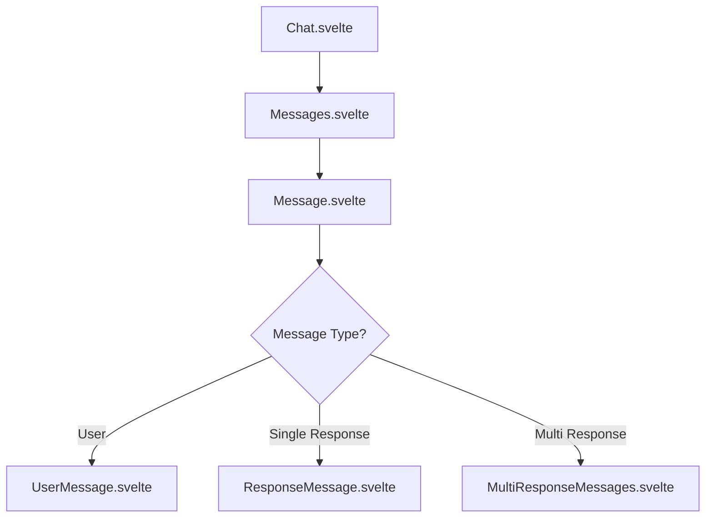
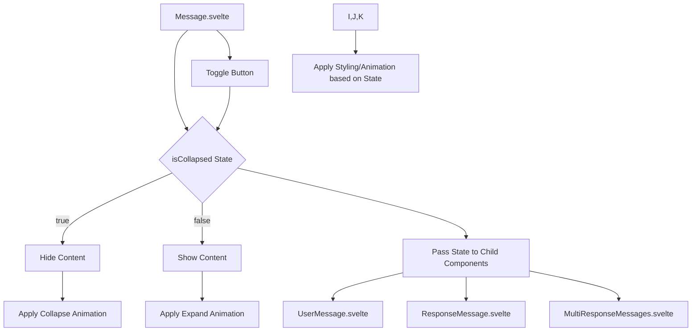

# 前端优化计划

## 任务目标

优化 Open WebUI 前端性能，去除不必要的对话日志输出，并为对话消息添加折叠/展开过渡动画。

## 当前分析

通过对 `src/lib/components/chat/Chat.svelte`、`src/lib/components/chat/Messages.svelte`、`src/lib/components/chat/Messages/UserMessage.svelte`、`src/lib/components/chat/Messages/ResponseMessage.svelte` 和 `src/lib/components/chat/Messages/MultiResponseMessages.svelte` 文件的分析，识别出多处 `console.log` 和 `console.debug` 语句，以及部分 `console.error` 和 `console.warn` 语句，这些可以在优化性能时考虑移除或改进。

消息组件结构如下：

折叠/展开逻辑的概念性设计如下：

## 优化计划详情

1.  **移除不必要的日志语句：**
    *   删除 `src/lib/components/chat/Chat.svelte`、`src/lib/components/chat/Messages.svelte`、`src/lib/components/chat/Messages/UserMessage.svelte` 和 `src/lib/components/chat/Messages/MultiResponseMessages.svelte` 中所有用于调试或信息输出的 `console.log` 和 `console.debug` 语句。
    *   审查 `console.error` 和 `console.warn` 语句，对于用户界面不应显示的内部错误或警告，考虑移除或替换为更合适的错误处理机制（例如发送到后端日志系统）。保留对用户可见的错误提示（如 `toast.error`）。

2.  **添加对话折叠动画：**
    *   **修改 `src/lib/components/chat/Messages/Message.svelte`：**
        *   在组件内部添加一个状态变量，例如 `isCollapsed`，默认为 `false`。
        *   添加一个按钮（例如一个箭头图标），用于切换 `isCollapsed` 的状态。这个按钮可以放置在消息头部，例如用户或模型名称旁边。
        *   使用 Svelte 的 `{#if !isCollapsed}` 结构来条件渲染消息的主要内容区域（包括文本、图片、文件等）。
        *   为消息内容区域添加 Svelte 的 `transition:slide` 或 CSS 动画类，以实现平滑的折叠和展开效果。
    *   **修改 `src/lib/components/chat/Messages/UserMessage.svelte`、`src/lib/components/chat/Messages/ResponseMessage.svelte` 和 `src/lib/components/chat/Messages/MultiResponseMessages.svelte`：**
        *   这些组件是实际渲染消息内容的，需要接收 `isCollapsed` 状态作为 prop。
        *   根据 `isCollapsed` 的值，调整内部布局和样式，确保内容在折叠时隐藏，在展开时显示，并配合父组件的动画效果。例如，可以根据状态添加或移除 CSS 类来控制元素的 `display` 或 `max-height` 属性，并结合 `transition` 实现动画。
    *   **考虑折叠状态的持久化：** 决定是否需要在用户刷新页面或切换聊天时保留消息的折叠状态。如果需要，可以将折叠状态存储在 `history` 对象中或使用本地存储。初步计划不进行持久化，每次加载聊天时默认为展开状态。

3.  **进一步性能优化（初步）：**
    *   **审查 `createMessagesList`：** 分析 `src/lib/utils/index.ts` 中的 `createMessagesList` 函数，了解其工作原理。如果它在每次 `history` 变化时都重新构建整个消息数组，并且 `history` 变化频繁，可能会成为性能瓶颈。可以考虑优化此函数，例如只处理增量更新，或者在需要时才调用它。
    *   **优化响应式声明：** 检查 `$: if (history.messages)` 等依赖于 `history.messages` 的响应式声明。如果可能，尝试缩小依赖范围，或者使用更精细的响应式控制，避免在 `history.messages` 的微小变化时触发大量不必要的计算或 DOM 更新。
    *   **虚拟化长列表：** 如果聊天记录非常长，考虑对消息列表进行虚拟化，只渲染当前在视口中的消息，以减少 DOM 元素的数量，从而提高渲染性能。这可能需要对 `src/lib/components/chat/Messages.svelte` 进行较大改动，引入虚拟列表库。此项为可选优化，优先级低于前两项。

## 后续步骤

在您确认此计划后，我将切换到 Code 模式来执行上述优化步骤。