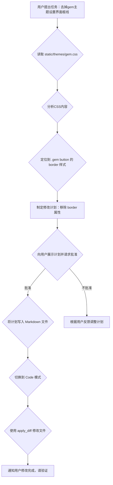

# 移除 Gem 主题设置界面框线计划

## 问题描述

在 Gem 主题下，设置界面的不同区域或卡片（实际为带有特定类名的 `button` 元素）之间存在突兀的框线。

## 目标

移除 Gem 主题下设置界面卡片之间的框线，提升视觉一致性。

## 分析

通过读取 `static/themes/gem.css` 文件并结合用户提供的 HTML 结构，定位到 `.gem button` 样式中包含 `border: 1px solid var(--gem-border-color);` 属性，该属性导致了卡片周围的边框。

## 计划步骤

1.  **确认问题样式：** 已确认 `static/themes/gem.css` 文件中 `.gem button` 样式中的 `border` 属性是导致框线的原因。
2.  **制定修改方案：** 从 `.gem button` 样式中移除 `border: 1px solid var(--gem-border-color);` 这一行。
3.  **实施修改：** 使用 `apply_diff` 工具对 `static/themes/gem.css` 文件进行修改。
4.  **验证结果：** 在应用中查看设置界面，确认框线是否已移除。

## 实施细节

将使用 `apply_diff` 工具修改 `static/themes/gem.css` 文件。具体的修改内容是删除 `.gem button` 规则块内的 `border: 1px solid var(--gem-border-color);` 这一行。

## 后续行动

计划已制定并记录在案。下一步将切换到 Code 模式，执行修改文件的操作。