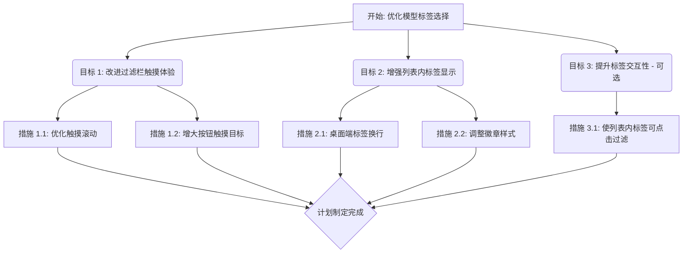

# Open WebUI 模型标签选择优化计划

## 背景

本计划旨在优化 Open WebUI 中模型选择界面的标签交互和显示，提升用户体验，特别是针对触摸设备。主要涉及的文件是 `src/lib/components/chat/ModelSelector/Selector.svelte`。

## 优化目标与措施

### 目标 1: 改进顶部标签过滤栏的触摸体验

*   **措施 1.1: 优化触摸滚动**: 确保顶部的水平标签过滤栏能够通过手指滑动（swipe）流畅地滚动。检查并可能调整 CSS，确保 `overflow-x: auto` 和相关触摸优化属性生效。
*   **措施 1.2: 增大触摸目标**: 适当增加过滤栏中每个标签按钮的垂直内边距（padding），使其更容易在触摸屏上准确点击。

### 目标 2: 增强模型列表中标签的显示效果

*   **措施 2.1: 桌面端标签换行**: 修改桌面端模型项目中的标签显示方式，让标签在空间不足时自动换行（使用 `flex-wrap: wrap`），而不是在项目内部进行水平滚动。
*   **措施 2.2: 调整徽章样式**: 略微增大标签徽章本身的字体大小或内边距，提升可读性。

### 目标 3: 提升标签交互性 (可选增强 - 本次不实施)

*   **措施 3.1: 使列表内标签可点击过滤**: 让显示在每个模型项内部的标签徽章也具有点击功能。点击某个标签徽章时，自动触发顶部的标签过滤，筛选出包含该标签的所有模型。

## Mermaid 图

## 下一步

切换到 Code 模式以实施此计划。