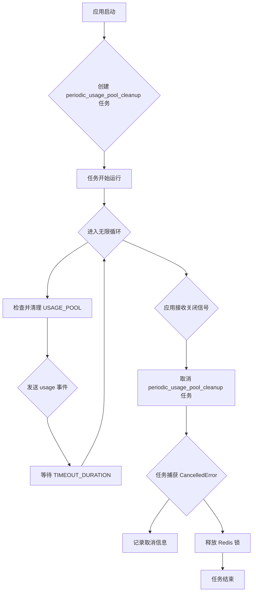

# 处理应用关闭时 CancelledError 的计划

## 问题描述

在应用关闭时，日志中出现 `asyncio.exceptions.CancelledError` 堆栈跟踪。这通常发生在正在运行的异步任务（如等待队列的任务）在应用接收到关闭信号时被取消。

## 原因分析

通过查看 `backend/open_webui/main.py` 和 `backend/open_webui/socket/main.py` 文件，发现应用启动时创建了一个名为 `periodic_usage_pool_cleanup` 的后台任务。该任务包含一个无限循环，通过 `asyncio.sleep` 定期执行清理操作。当应用关闭时，此后台任务被取消，导致 `CancelledError`。

## 解决方案计划

为了优雅地处理 `CancelledError` 并避免不必要的日志输出，我们将在 `periodic_usage_pool_cleanup` 函数中捕获此异常，并在任务被取消时执行必要的清理（例如释放 Redis 锁）。

### 详细步骤

1.  **修改 `backend/open_webui/socket/main.py` 文件。**
2.  **在 `periodic_usage_pool_cleanup` 函数的 `while True:` 循环外部添加一个 `try...except asyncio.CancelledError` 块。**
3.  **在 `except asyncio.CancelledError:` 块中，记录任务被取消的信息，例如 `log.info("periodic_usage_pool_cleanup task cancelled.")`。**
4.  **在 `try...except` 块之后添加一个 `finally` 块，确保在任务结束前（无论是正常完成还是被取消）释放 Redis 锁，调用 `release_func()`。**

### 计划可视化

## 下一步

在您审阅并确认此计划后，我们可以切换到 Code 模式来实施这些修改。