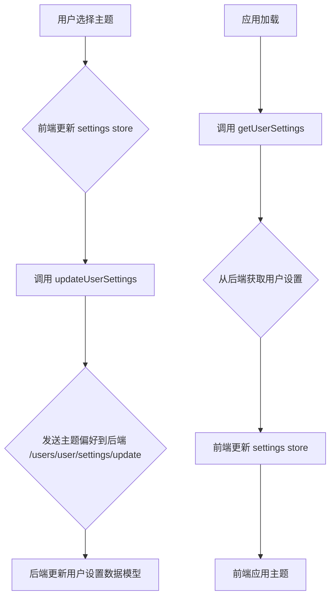

# 优化后端主题存储与前端主题恢复计划

## 目标

将用户选择的主题偏好持久化存储在后端，并在前端应用加载时恢复，以提供更一致的用户体验。

## 当前分析

- 主题文件存储在 `static/themes/` 目录下，是 CSS 文件。
- 用户设置通过 `/users/user/settings` 和 `/users/user/settings/update` 接口在前端和后端之间同步。
- 前端使用独立的 `theme` store 管理当前主题，但未与后端用户设置关联。

## 计划步骤

1.  **后端修改**:
    *   修改后端用户设置的数据模型，添加一个字段用于存储主题偏好（例如 `theme: string`）。
    *   修改 `/users/user/settings` 接口，使其在获取用户设置时返回主题偏好。
    *   修改 `/users/user/settings/update` 接口，使其能够接收并更新主题偏好。

2.  **前端修改**:
    *   修改 `src/lib/types/index.ts` 中的 `Settings` 类型定义，添加 `theme` 字段。
    *   修改 `src/lib/stores/index.ts` 中的 `settings` store 初始化，使其包含从后端获取的主题偏好。
    *   修改前端应用主题的逻辑，使其从 `settings` store 中获取主题偏好并应用。
    *   修改用户界面中选择主题的部分，使其更新 `settings` store 并调用 `updateUserSettings` 将主题偏好发送到后端。

## 流程图

## 后续行动

在您确认计划文件已成功创建后，我将请求切换到 Code 模式，以便开始实施上述计划。